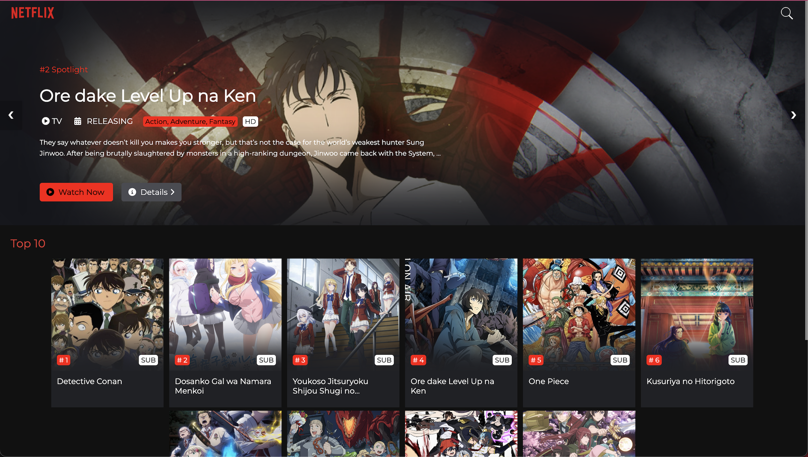

  

  <h1>Anime Library</h1>

Anime Library is a web application that allows users to watch ad-free anime. The application provides users with access to a wide range of anime episodes and information about the top airing anime powered by Gogoanime and AniList

  <h2> Demo</h2>
  <ul>
    <li><a href="https://tenzinkunchok25.github.io/AnimeLibrary/" taget="_blank" style="text-decoration:none">Github Pages</a></li>
  </ul>

<h2>🛠️ Features</h2>

  Free and Ad-Free: Enjoy watching anime without any cost or interruptions from advertisements. 
  Wide Selection: Access a diverse library of anime episodes from various genres. 
  Top Airing Anime: Stay up-to-date with information about the top airing anime..

<h2>🏠 How to Use</h2>
  
Clone the repository to your local machine.  
    Open the index.html file in your web browser.

  <h2>💻 Technologies Used</h2>
  <ul>
    <li>HTML</li>
    <li>CSS</li>
    <li>JavaScript</li>
  </ul>

  <h2>🪪 License</h2>

This project is licensed under the MIT License - see the LICENSE file for details.

